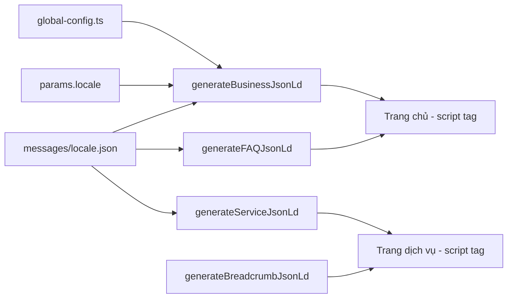

# Tài liệu Thiết kế — Tối ưu SEO cho massagetannha.com

## Tổng quan

Tài liệu này mô tả thiết kế kỹ thuật cho việc tối ưu SEO toàn diện website Iku Massage (https://massagetannha.com). Website hiện tại là ứng dụng Next.js 14 sử dụng App Router với static export (`output: 'export'`), hỗ trợ 3 ngôn ngữ (vi, en, ko) thông qua dynamic segment `[locale]`.

### Hiện trạng và vấn đề cần giải quyết

1. **metadataBase** đang trỏ sai đến `https://idmassage.com` thay vì `https://massagetannha.com`
2. **Thẻ `<html lang>`** bị hardcode `lang="vi"` trong `app/layout.tsx`, không thay đổi theo locale
3. **JSON-LD** trên trang chủ có `url: undefined`, thiếu FAQPage schema, thiếu BreadcrumbList trên trang dịch vụ
4. **Không có sitemap.xml** và **robots.txt**
5. **Hình ảnh** trên trang dịch vụ dùng `` thay vì Next.js `<Image>`, thiếu `width`/`height`, alt text chưa đầy đủ
6. **Thiếu hreflang tags** đầy đủ và canonical URL với domain chính xác
7. **Thiếu thẻ `<meta name="keywords">`** trên trang dịch vụ

### Mục tiêu

- Đạt điểm SEO tối ưu trên Lighthouse (>90)
- Google có thể crawl và index đầy đủ nội dung đa ngôn ngữ
- Hiển thị rich snippets (FAQ, Business, Service, Breadcrumb) trên SERP
- Cải thiện Core Web Vitals (CLS, LCP, FID)

## Kiến trúc

### Tổng quan kiến trúc

Vì website sử dụng **static export**, tất cả SEO metadata phải được sinh tại **build time** thông qua Next.js Metadata API (`generateMetadata`), `sitemap.ts`, và `robots.ts`.

```mermaid
graph TD
    A[Build Time] --> B[generateMetadata - Mỗi page]
    A --> C[sitemap.ts - /sitemap.xml]
    A --> D[robots.ts - /robots.txt]
    A --> E[JSON-LD Scripts - Inline]
    
    B --> B1[Title + Description]
    B --> B2[Open Graph]
    B --> B3[Hreflang + Canonical]
    B --> B4[Keywords]
    
    E --> E1[HealthAndBeautyBusiness]
    E --> E2[FAQPage]
    E --> E3[Service + BreadcrumbList]
    
    subgraph "Locale Layout"
        F[app/layout.tsx] -->|dynamic lang| G[html lang=locale]
        H[app/[locale]/layout.tsx] --> B
    end
```

### Nguyên tắc thiết kế

1. **Tập trung vào Metadata API của Next.js**: Sử dụng `generateMetadata` thay vì tự render `<head>` tags
2. **Dữ liệu từ i18n messages**: Tận dụng file `messages/*.json` hiện có cho nội dung SEO
3. **Không thêm dependency mới**: Tất cả tính năng SEO đều dùng built-in Next.js API
4. **Static generation**: Mọi thứ phải tương thích với `output: 'export'`

## Thành phần và Giao diện

### 1. SEO Metadata (generateMetadata)

**Vị trí**: `app/[locale]/layout.tsx` và `app/[locale]/page.tsx`, `app/[locale]/dich-vu/[slug]/page.tsx`

**Thay đổi chính**:
- Cập nhật `metadataBase` thành `https://massagetannha.com`
- Thêm hreflang alternates đầy đủ cho cả 3 locale + x-default
- Sinh canonical URL với domain đầy đủ
- Thêm `og:image`, `og:url` vào Open Graph metadata
- Thêm `keywords` meta tag cho trang dịch vụ

```typescript
// app/[locale]/layout.tsx - generateMetadata
export async function generateMetadata({ params }: { params: { locale: string } }): Promise<Metadata> {
  const locale = params.locale as Locale;
  const path = `/${locale}/`;
  return {
    metadataBase: new URL('https://massagetannha.com'),
    alternates: {
      canonical: path,
      languages: {
        vi: '/vi/',
        en: '/en/',
        ko: '/ko/',
        'x-default': '/vi/',
      },
    },
  };
}
```

### 2. Sitemap Generator

**Vị trí**: `app/sitemap.ts`

Sinh file `sitemap.xml` tại build time bao gồm:
- Trang chủ cho mỗi locale: `/vi/`, `/en/`, `/ko/`
- Trang dịch vụ cho mỗi locale × mỗi slug (4 dịch vụ × 3 locale = 12 URL)
- Thẻ `alternates.languages` cho mỗi URL

```typescript
// Interface
interface SitemapEntry {
  url: string;
  lastModified: Date;
  changeFrequency: 'daily' | 'weekly' | 'monthly';
  priority: number;
  alternates?: {
    languages: Record<string, string>;
  };
}
```

### 3. Robots Generator

**Vị trí**: `app/robots.ts`

```typescript
// Output
{
  rules: { userAgent: '*', allow: '/', disallow: ['/_next/'] },
  sitemap: 'https://massagetannha.com/sitemap.xml',
}
```

### 4. JSON-LD Schema Components

**Vị trí**: `lib/seo.ts` (utility functions mới)

Các hàm helper sinh JSON-LD:

```typescript
// Interfaces
interface BusinessJsonLd {
  '@context': 'https://schema.org';
  '@type': 'HealthAndBeautyBusiness';
  name: string;
  description: string;
  telephone: string;
  email: string;
  address: PostalAddress;
  url: string;
  priceRange: string;
  areaServed: City;
  serviceType: string;
}

interface ServiceJsonLd {
  '@context': 'https://schema.org';
  '@type': 'Service';
  name: string;
  description: string;
  provider: { '@type': 'HealthAndBeautyBusiness'; name: string; url: string };
}

interface FAQJsonLd {
  '@context': 'https://schema.org';
  '@type': 'FAQPage';
  mainEntity: Array<{
    '@type': 'Question';
    name: string;
    acceptedAnswer: { '@type': 'Answer'; text: string };
  }>;
}

interface BreadcrumbJsonLd {
  '@context': 'https://schema.org';
  '@type': 'BreadcrumbList';
  itemListElement: Array<{
    '@type': 'ListItem';
    position: number;
    name: string;
    item: string;
  }>;
}

// Exported functions
function generateBusinessJsonLd(locale: Locale, translations: any): BusinessJsonLd;
function generateFAQJsonLd(translations: any): FAQJsonLd;
function generateServiceJsonLd(locale: Locale, serviceName: string, serviceDescription: string): ServiceJsonLd;
function generateBreadcrumbJsonLd(locale: Locale, items: Array<{name: string; url: string}>): BreadcrumbJsonLd;
```

### 5. Dynamic HTML Lang

**Vị trí**: `app/[locale]/layout.tsx` hoặc `app/layout.tsx`

**Vấn đề**: `app/layout.tsx` hiện hardcode `<html lang="vi">`. Với static export, cần chuyển `<html>` tag vào `app/[locale]/layout.tsx` để có thể set `lang` theo locale.

**Giải pháp**: Chuyển `RootLayout` thành wrapper đơn giản (chỉ render `{children}`), và đưa `<html>` + `<body>` vào `app/[locale]/layout.tsx` nơi có access đến `params.locale`.

### 6. Image Optimization

**Thay đổi trong components**:
- `app/[locale]/dich-vu/[slug]/page.tsx`: Thay `` bằng Next.js `<Image>` với `width`, `height`, `sizes`, và alt text theo locale
- `components/FeaturedServiceCard.tsx`: Thêm `loading="lazy"`, `width`, `height`
- Đảm bảo hero banner (`components/Hero.tsx`) giữ `priority` và có `sizes` phù hợp

**Lưu ý**: Vì `output: 'export'` yêu cầu `images.unoptimized: true`, Next.js `<Image>` vẫn render `` nhưng tự động thêm `width`, `height`, `loading`, `sizes` — giúp tránh CLS.

## Mô hình Dữ liệu

### SEO Configuration Constants

```typescript
// lib/seo.ts
const SITE_URL = 'https://massagetannha.com';
const LOCALES = ['vi', 'en', 'ko'] as const;
const DEFAULT_LOCALE = 'vi';
const OG_LOCALES: Record<Locale, string> = {
  vi: 'vi_VN',
  en: 'en_US',
  ko: 'ko_KR',
};
```

### Metadata Templates

Metadata cho mỗi trang được sinh từ:
1. **Trang chủ**: `titles[locale]`, `descriptions[locale]`, `keywords[locale]` — đã có trong `app/[locale]/page.tsx`
2. **Trang dịch vụ**: Lấy từ `translations.featuredServices.services[slug]` — tên dịch vụ + overview + brand name

### Sitemap Data Model

```typescript
// Mỗi entry trong sitemap
{
  url: `${SITE_URL}/${locale}/`,           // hoặc /${locale}/dich-vu/${slug}/
  lastModified: new Date(),                 // build date
  changeFrequency: 'weekly',
  priority: 1.0,                            // 1.0 cho trang chủ, 0.8 cho dịch vụ
  alternates: {
    languages: {
      vi: `${SITE_URL}/vi/`,
      en: `${SITE_URL}/en/`,
      ko: `${SITE_URL}/ko/`,
      'x-default': `${SITE_URL}/vi/`,
    }
  }
}
```

### JSON-LD Data Flow




## Correctness Properties

*Một property là một đặc tính hoặc hành vi phải luôn đúng trong mọi lần thực thi hợp lệ của hệ thống — về bản chất, đó là một phát biểu hình thức về những gì hệ thống phải làm. Properties đóng vai trò cầu nối giữa đặc tả dễ đọc cho con người và đảm bảo tính đúng đắn có thể kiểm chứng bằng máy.*

### Property 1: Metadata length constraints

*For any* tổ hợp trang (trang chủ hoặc trang dịch vụ) và locale (vi, en, ko), thẻ title được sinh ra phải có độ dài ≤ 60 ký tự và thẻ description phải có độ dài ≤ 155 ký tự.

**Validates: Requirements 1.1, 1.2**

### Property 2: Service title contains service name and brand

*For any* trang dịch vụ và locale, thẻ title phải chứa tên dịch vụ (từ translations) và tên thương hiệu (từ config).

**Validates: Requirements 1.3**

### Property 3: Metadata completeness

*For any* tổ hợp trang và locale, metadata phải bao gồm đầy đủ Open Graph tags (og:title, og:description, og:type, og:locale) và thẻ keywords không rỗng.

**Validates: Requirements 1.4, 10.4**

### Property 4: Hreflang completeness

*For any* trang (trang chủ hoặc trang dịch vụ), metadata alternates phải chứa hreflang cho tất cả 3 locale (vi, en, ko) cùng x-default trỏ đến phiên bản `/vi/`. Với trang dịch vụ, hreflang phải trỏ đến cùng slug trên tất cả locale.

**Validates: Requirements 2.1, 2.2, 2.5**

### Property 5: Canonical URL correctness

*For any* trang và locale, canonical URL phải bắt đầu bằng `https://massagetannha.com` và chứa đường dẫn trang hiện tại.

**Validates: Requirements 2.3, 2.4**

### Property 6: Sitemap entry completeness

*For any* tổ hợp locale × slug dịch vụ, sitemap phải chứa URL đầy đủ bắt đầu bằng `https://massagetannha.com`, và mỗi entry phải có alternates.languages cho tất cả locale + x-default.

**Validates: Requirements 3.3, 3.4, 3.5**

### Property 7: Business JSON-LD completeness

*For any* locale, hàm `generateBusinessJsonLd` phải trả về object JSON-LD với `@type: HealthAndBeautyBusiness` chứa đầy đủ các trường: name, description, telephone, email, address, url (bắt đầu bằng `https://massagetannha.com`), priceRange, areaServed, serviceType — và url không được là `undefined`.

**Validates: Requirements 5.1, 5.5**

### Property 8: Service JSON-LD completeness

*For any* tổ hợp locale và slug dịch vụ, hàm `generateServiceJsonLd` phải trả về object JSON-LD với `@type: Service` chứa name, description, và provider tham chiếu đến HealthAndBeautyBusiness.

**Validates: Requirements 5.2**

### Property 9: FAQ JSON-LD completeness

*For any* locale, hàm `generateFAQJsonLd` phải trả về object JSON-LD với `@type: FAQPage` chứa đúng số lượng câu hỏi từ translations, mỗi câu hỏi có `name` và `acceptedAnswer.text` không rỗng.

**Validates: Requirements 5.3**

### Property 10: Breadcrumb JSON-LD on service pages

*For any* trang dịch vụ và locale, hàm `generateBreadcrumbJsonLd` phải trả về object JSON-LD với `@type: BreadcrumbList` chứa ít nhất 3 items (Trang chủ → Dịch vụ → Tên dịch vụ) với position tăng dần.

**Validates: Requirements 5.4**

### Property 11: JSON-LD locale-awareness

*For any* hai locale khác nhau, nội dung JSON-LD (description trong Business, text trong FAQ) phải khác nhau, phản ánh đúng ngôn ngữ tương ứng.

**Validates: Requirements 5.6, 10.3**

### Property 12: Trailing slash consistency

*For any* URL được sinh ra trong sitemap, metadata alternates, hoặc canonical, URL phải kết thúc bằng dấu `/`.

**Validates: Requirements 9.1**

### Property 13: Locale-appropriate keywords

*For any* locale, thẻ keywords phải chứa từ khóa phù hợp với ngôn ngữ đó (ví dụ: locale `vi` phải chứa ký tự tiếng Việt, locale `ko` phải chứa ký tự Hàn Quốc).

**Validates: Requirements 10.1**

## Xử lý Lỗi

### Metadata Fallbacks
- Nếu translations không có dữ liệu cho một service slug → sử dụng tên thương hiệu làm title mặc định (đã có logic `notFound()`)
- Nếu description quá dài → truncate tại 155 ký tự (hàm `truncateForMeta` đã có)
- Nếu locale không hợp lệ → fallback về `vi` (default locale)

### JSON-LD Fallbacks
- Nếu FAQ translations thiếu → sinh FAQPage với mảng rỗng (không crash)
- Nếu service data thiếu → không render JSON-LD Service (skip gracefully)
- Phone number formatting: chuyển `0345...` thành `+8434...` (đã có logic)

### Sitemap/Robots
- Sitemap và robots được sinh tại build time → nếu build thành công, file luôn hợp lệ
- Không cần runtime error handling

### Image Fallbacks
- Nếu hình ảnh không load → `onError` handler ẩn ảnh hoặc hiển thị logo (đã có)
- Alt text fallback: sử dụng tên dịch vụ nếu không có alt text riêng

## Chiến lược Kiểm thử

### Dual Testing Approach

Sử dụng kết hợp **unit tests** và **property-based tests** để đảm bảo coverage toàn diện.

### Unit Tests

Tập trung vào các trường hợp cụ thể và edge cases:

1. **Robots.txt output**: Verify exact content (User-agent, Allow, Disallow, Sitemap URL)
2. **OG locale mapping**: Verify vi→vi_VN, en→en_US, ko→ko_KR (3 examples)
3. **metadataBase**: Verify equals `https://massagetannha.com`
4. **Sitemap contains all homepage URLs**: Verify /vi/, /en/, /ko/ present
5. **Root page redirect**: Verify redirect to /{defaultLocale}/
6. **HTML lang attribute**: Verify lang matches locale for each of 3 locales

### Property-Based Tests

Sử dụng thư viện **fast-check** cho TypeScript/JavaScript.

Cấu hình:
- Mỗi property test chạy tối thiểu **100 iterations**
- Mỗi test có comment tag: `Feature: seo-optimization, Property {number}: {title}`

Properties cần implement:
1. **Property 1**: Metadata length constraints — sinh random locale × page, verify title ≤ 60, description ≤ 155
2. **Property 2**: Service title contains service name and brand — sinh random locale × slug, verify containment
3. **Property 3**: Metadata completeness — sinh random locale × page, verify OG + keywords present
4. **Property 4**: Hreflang completeness — sinh random page, verify all 3 locales + x-default
5. **Property 5**: Canonical URL correctness — sinh random page, verify domain prefix
6. **Property 6**: Sitemap entry completeness — verify all locale × slug entries present with alternates
7. **Property 7**: Business JSON-LD completeness — sinh random locale, verify all required fields
8. **Property 8**: Service JSON-LD completeness — sinh random locale × slug, verify fields
9. **Property 9**: FAQ JSON-LD completeness — sinh random locale, verify question count and content
10. **Property 10**: Breadcrumb JSON-LD — sinh random service page, verify structure
11. **Property 11**: JSON-LD locale-awareness — sinh 2 random different locales, verify content differs
12. **Property 12**: Trailing slash consistency — verify all generated URLs end with `/`
13. **Property 13**: Locale-appropriate keywords — sinh random locale, verify keyword language match

### Test File Structure

```
__tests__/
  seo/
    seo.unit.test.ts        # Unit tests cho robots, OG mapping, metadataBase, etc.
    seo.property.test.ts    # Property-based tests với fast-check
```

### Dependencies cần thêm (devDependencies)

```json
{
  "fast-check": "^3.x",
  "@types/jest": "^29.x",
  "jest": "^29.x",
  "ts-jest": "^29.x"
}
```

Hoặc nếu project đã dùng testing framework khác, adapt accordingly. Khuyến nghị dùng **Vitest** vì tương thích tốt với Next.js:

```json
{
  "fast-check": "^3.x",
  "vitest": "^1.x"
}
```
